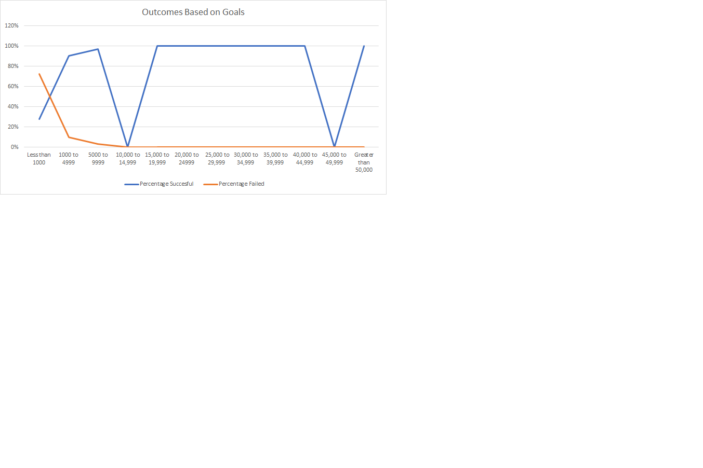

# kickstarter-analysis
Performing analysis on Kickstarter data to uncover trends.
## Overview of data
The purpose of this analysis was to visualize the campaign outcomes of number of projects ("successful," "failed," and "canceled"). We want to visualize the relationship between outcomes and launch month. Then find the subcategory column using plays as a criteria. Lastly we want to create a line chart titled "Outcomes Based on Goal" to visualize the relationship between the goal-amount ranges on the x-axis and the percentage of successful, failed, or canceled projects on the y-axis.
### Theater Outcomes Based on Launch Date Conclusion

  

My conclusion on the data i got for Theater outcomes based on launch, it showed there were more successful theater movies in the summer time May-August. My last conclusion is the amount of movies that also failed around the same time but more Theater category seem to succeed. In conclusion it seems like Theater movies do better when they launch in the summer time but tend to still do good through the year as the grand total of successful movies doubles at 893 than the ones that have failed at 493.
#### Analysis and Challenges Theater Outcomes Based on Launch Date
There was no complication for this section, i think the complicated thing about this section was changing the row labels from the specific dates and times to just the months, it took me a while to figure it out but it turned out to be pretty simple.
###### Outcomes based on Goals conclusion and challanges

  
  

  The overview of outcomes based on goals was tedious at the beginning when trying to input the formula of COUNTIFS and SUM, i kept getting an error message on ecel stating i was missing something than after doing my line chart it was getting something totally different than what the manual was stating I was suppose to have in the line chart. After many attemps i was able to get a similar line chart but still was a bit off to the manaul. In conclusion, the result i got stated that the the number cancelled and failed had zeros through the column and movies that were successful were more successful with a goal lower than 9999 and decreased as the goal got higher. Same with the nummbers failed showed a better outcome at the beginning when the goal was less than 9999 and dropped to zero after that. The other things we couldve done with this data was compare the other categories lke technology as with this chart we found outcomes of "plays".
